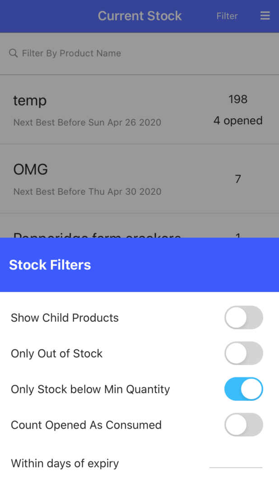
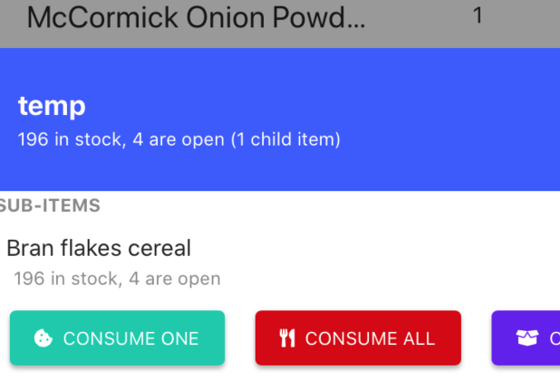

{: .image-frame.clearfix }

# Current Stock
This page of PantryParty shows the overview of your the current stock. You may use this page to check for items below
their minimum quantity, completely out of stock, or nearing their spoiled date.

## Filters
You may filter the products on screen by typing a part of the product name in the top search field.

Additional filters may be accessed by taping the `Filter` button in the top nav bar.

* **Show Child Products** - Default behavior is not to show  child products in this list because their quantities will be included
  in their parent product. Flipping this switch will make child products appear.
* **Only Out Of Stock** - Only show products currently at zero sock
* **Only Stock below Min Quantity** - Only show products which are below the minimum requirement. (Defined on Product)
* **Count Opened As Consumed** - When calculating **Only Out Of Stock**  and **Only Stock below Min Quantity** do not count opened items as in-stock.
* **Within days of expiry** - Limit results only to products which will expire with the specified days. `0` filters to expired products.

{: .image-frame.clearfix }

## Actions
You may consume, open, and spoil your stock by taping on the item in the list. Note that all sub-products with stock
are also shown under the parent product.
