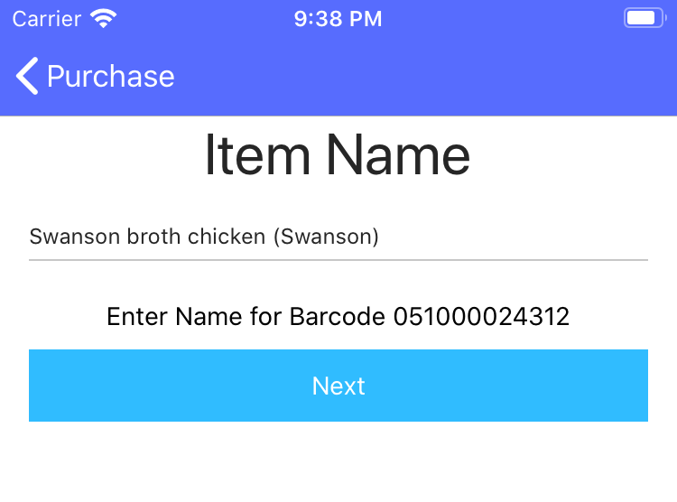
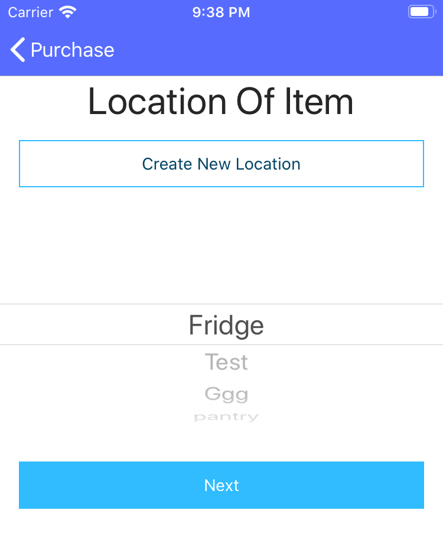
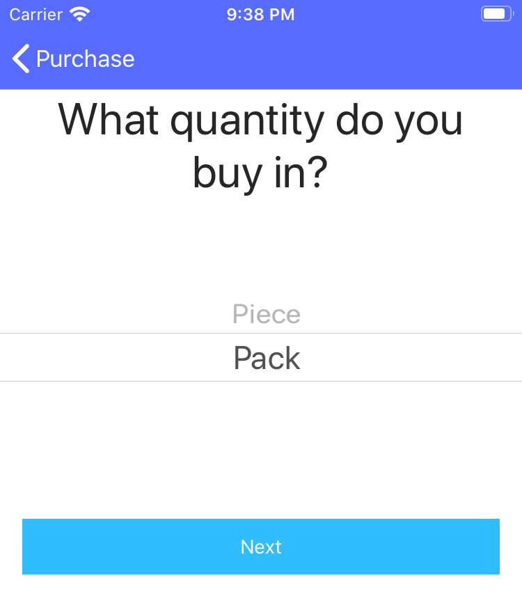
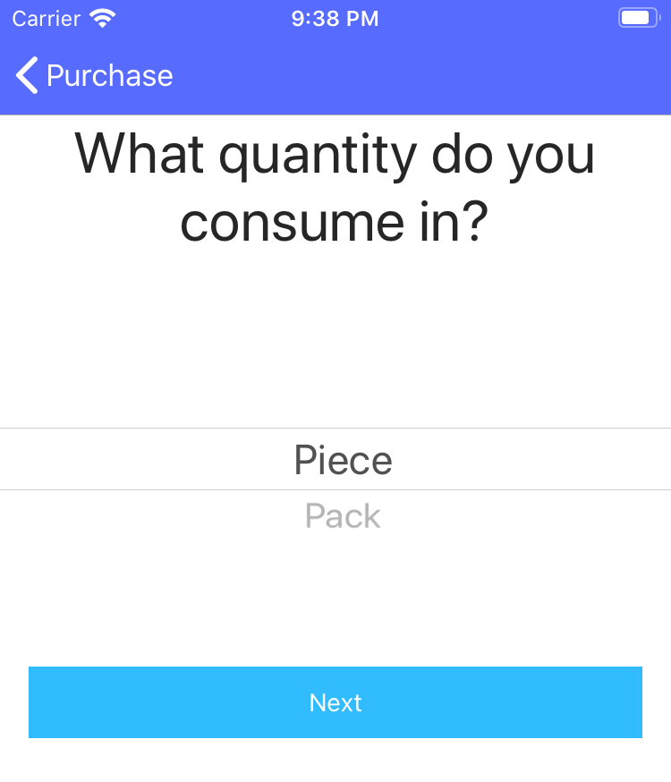
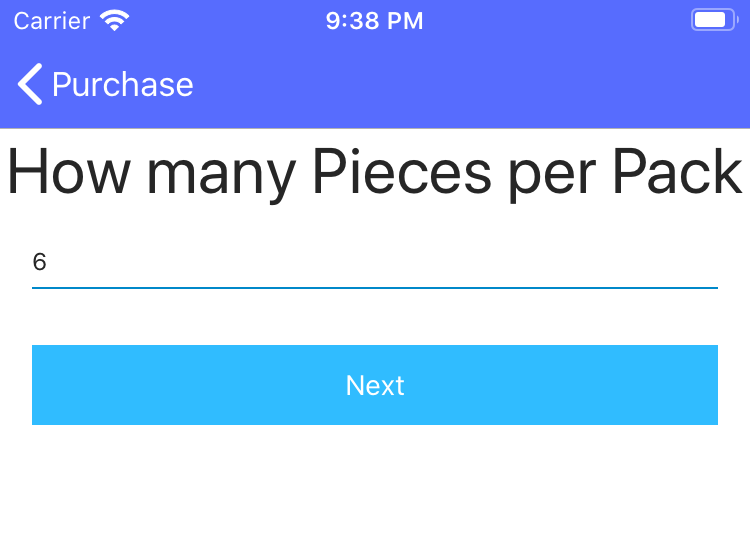
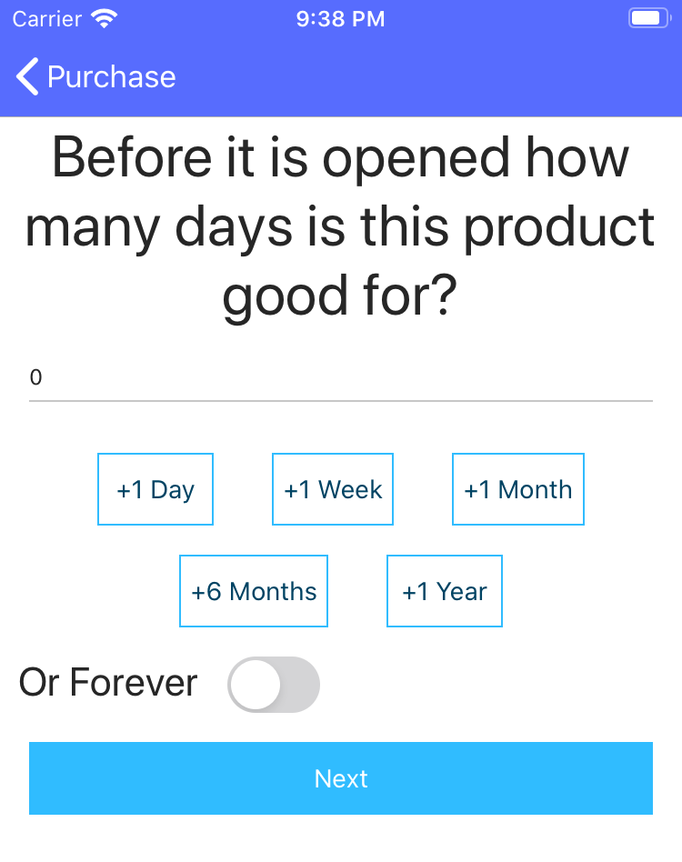
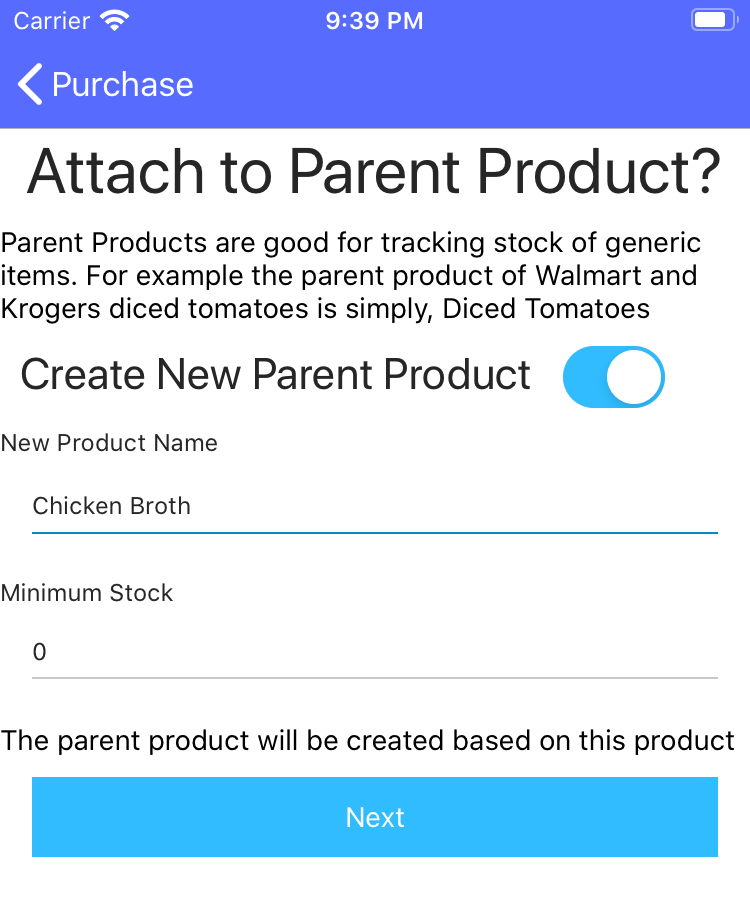
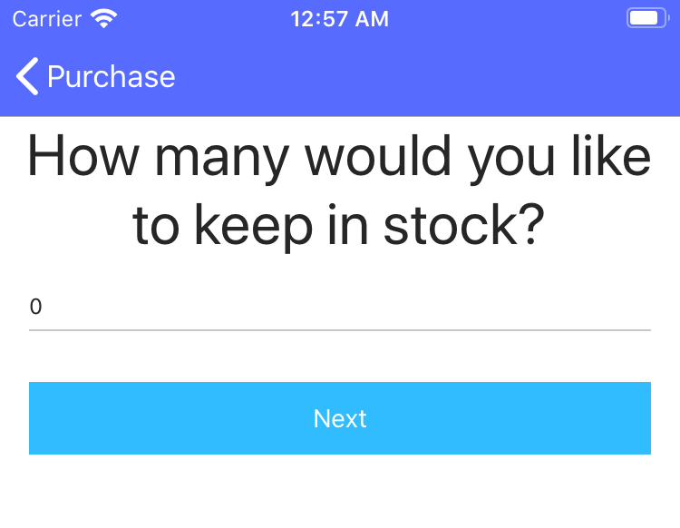

# Guided Product Creation
Guided product creation is currently only available after scanning a barcode not already associated with a Grocy product.

## Step 1: Select a product name
{: .clearfix }

{: .image-frame.clearfix }

Every product in Grocy requires a name. If PantryParty was able to lookup this item by barcode, the resutls of that search should be pre-filled out.

If the barcode did not result in a successful lookup you will need to enter the name manually. The barcode is displayed below the name input, you did put aside the failed scans right?
{: .clearfix }

{: .image-frame }
## Step 2: Select a Location

PantryParty leverages Grocy to help you track where your items are currently stored in your house. This could be the refrigerator, the freezer, the pantry or even under your sink. Selecting a location here will set it as the location for your currently scanned items. It will also use this as the default location for this scanned item in the future.
{: .clearfix }

## Step 3: Purchase Quantity

{: .image-frame }

Some items come in boxes, and are eaten by the piece. A 24-pack of soda is a very common example of this. You may tell PantryParty and Grocy that when you buy this item, you buy it by the X pack, but you eat it one at a time. On this screen you should select which unit you would like to buy in.
{: .clearfix }

## Step 4: Consume Quantity

{: .image-frame }

Like on the last screen, you should now select the method of consumption for this product. When removing this item from your inventory how many do you remove?
{: .clearfix }

## Step 5: Quantity Conversion

{: .image-frame }

This step may not show up if you selected the same unit for consumption and purchase. However if you selected a different unit of consumption and purchase you must now indicate how many items are in a consumed unit. In the soda example, this would be 24.
{: .clearfix }

## Step 6: Shelf Life Before Open

{: .image-frame }

One of the most powerful inventory management tools at your disposal in Grocy is the ability to track best before dates. No longer will you find a bag of cheese hidden in some drawer for a year. By telling PantryParty and Grocy how many days you can expect this product to remain good, you can be warned as product nears the end of it's life.

Buttons below provide quick access to extend the selected best before date. For items that are non-perishable you may select the "Forever" toggle.
{: .clearfix }

## Step 7: Shelf Life After Open

{: .image-frame }

Shelf life after open provides the same advantage as the shelf life before open. By setting this value you can gain insight to which of your opened products are expected to no longer be good next.
{: .clearfix }

## Step 8: Parent Product Creation or Selection

{: .image-frame }

PantryParty promotes a Grocy workflow which expects nearly all products to have a parent product. This screen allows you to select an existing product, or create a new one. When you create a new parent product you are also provided the opportunity to indicate how many of these items you would like to ensure remain in stock.
{: .clearfix }

## Step 9: Minimum Stock

{: .image-frame }

If you opted not to create or select a parent product you will be offered the opportunity to set the minimum of _this_ product to keep in stock.
{: .clearfix }

## Done
The next step offers you the opportunity to complete this product and move on to the next one, or to set some more values on this product.

Once you complete the product you will be taken through the same steps for the next product you have scanned until no products remain to be created. Congratulations! This is by far the hardest part of getting started with PantryParty and Grocy
