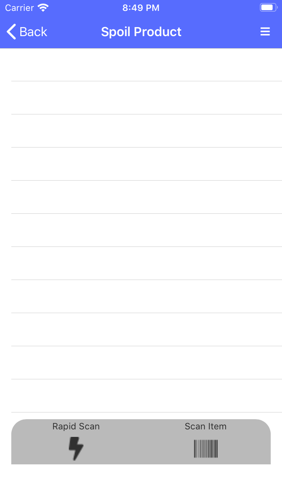

{: .image-frame.clearfix }

# Spoil
Spoiling an item removes it from the inventory without consuming it. Using spoil instead of consumption will help you track items you are not using efficiently.



