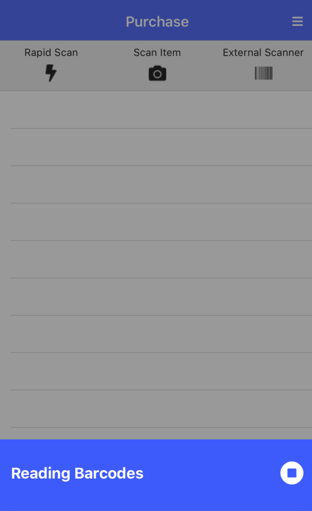

{: .image-frame.clearfix }
# Bluetooth Barcode Scanner Support
PantryParty has experimental support for bluetooth barcode scanners. Any device which connects as a keyboard
should be supported. Please set your barcode scanners to terminate scanned codes with

## How to enable
By default external barcode support is disabled. In order to enable external scanner support you must go to
Settings > External Scanner and flip the switch. Once you have flipped that switch a new option to scan will appear on
the Purchase, Consume, Spoil and Open page.
