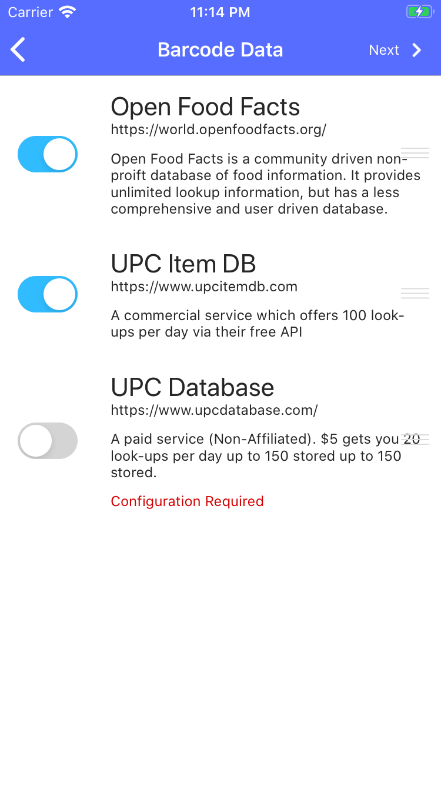

{: .image-frame.clearfix }
# Barcode Datasources

In order to fill in data for barcodes which are not yet associated to a product in Grocey, Patry Party utilized thrid party barcode databases. Multiple datasources are available, some free and some paid. You may enable or disable a datasource by flipping the associated toggle. You may also drag the data sources around to change their priority.

## [Open Food Facts](https://world.openfoodfacts.org/)
A datasource providing unlimited free lookups. Their database of barcode data is user power and may be more incomplete then other paid sources.
## [UPC Item DB](https://www.upcitemdb.com/)
A paid service which offers a free trial of 100 lookups per day. If you make this source a higher prioirity then Open Food Facts and you utilize all 100 lookups per day, PantryParty will automatically proceeded to the next configured data source.
## [UPC Database](https://www.upcdatabase.com/)
A paid service with no free tier. With a minimum payment of $5, you will receive 20 free lookups per day. Your free lookups accrue and you may bank up to 150 lookups. If you use your free lookups UPC Database will charge you $0.002/lookup. Most users will receive unlimited lookups for $5 by only utilizing freebies.

**NOTE:** PantryParty is not associated or affiliated with any barcode data sources

# Next
[Privacy Settings](./privacy-settings)
