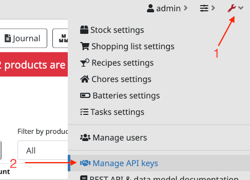
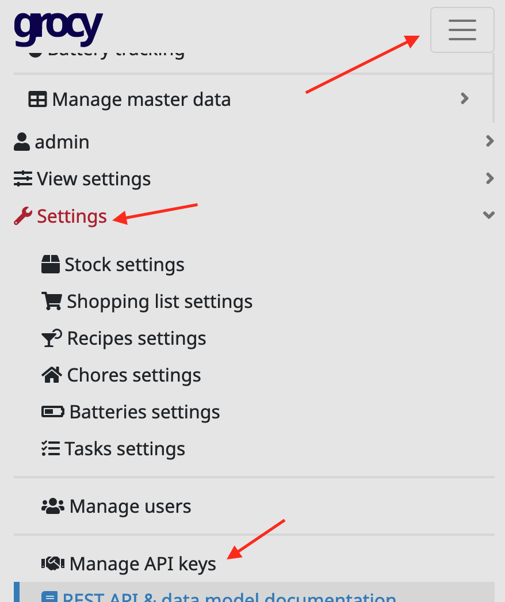
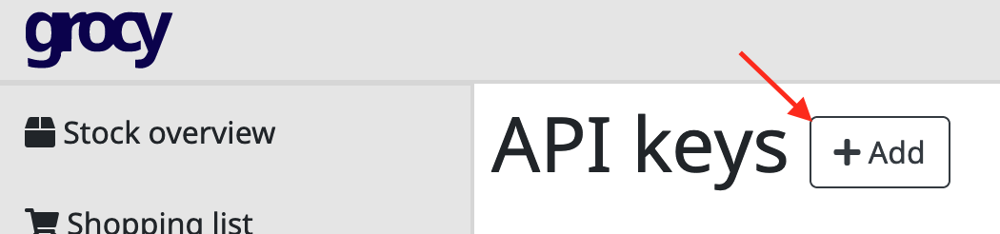
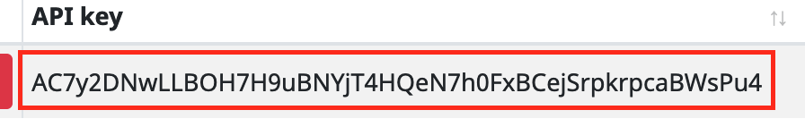
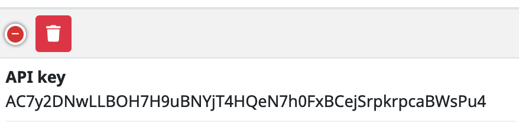
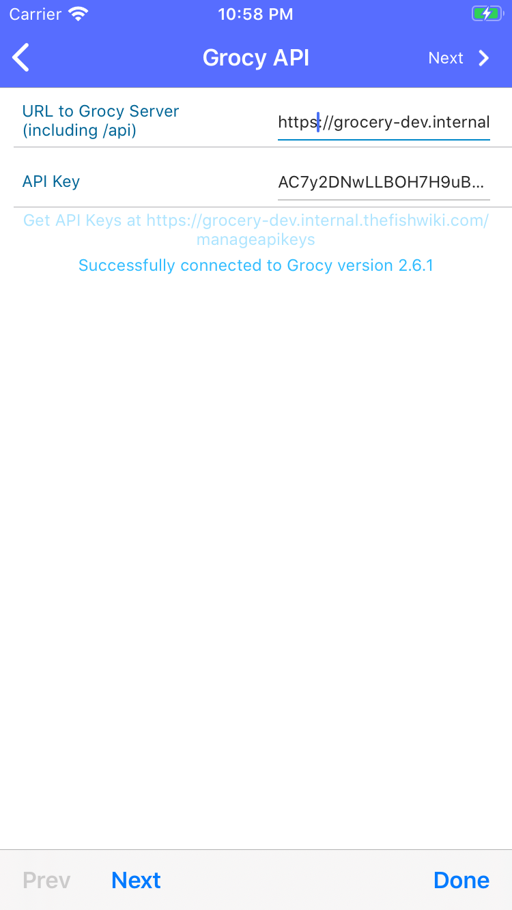

**If you are using [ HomeAssistant ](https://www.home-assistant.io/) to manage your Grocy Instance you MUST follow [these instructions](./configure-has)**

# Grocy API Configuration

This critical step connect the PantryParty app to your install of Grocy.

## Create An API Key

1) Login to your Grocy install and head to the Manage API Keys section in the
configuration area.

| Desktop | Mobile |
| ------- | ------ |
|  |  |
{: .table-2col-even}

2) Click the `+ Add` button on the top right of the screen to generate a new API Key.
If you already have an API key, best practices dictate that you should create a new
API key for each consumer.

3) Copy the API key you just created (on mobile you need to click the green `+`)

| Desktop | Mobile |
| ------- | ------ |
|  |  |

>
{: .image-frame.clearfix }
## Configure PantryParty

Paste the API key you created into the second field in the form. Once the
API is entered fill in the URL to the Grocy Server. This URL should include
the /api path component.

As you type, PantryParty will reach out to verify your connectivity. Most
common errors should show up as a human readable response.

Once a connection to Grocy has been established your current Grocy version
will be displayed and a Next button will appear in the Nav bar

# Next
[Barcode Datasources](./barcode-data-sources)
