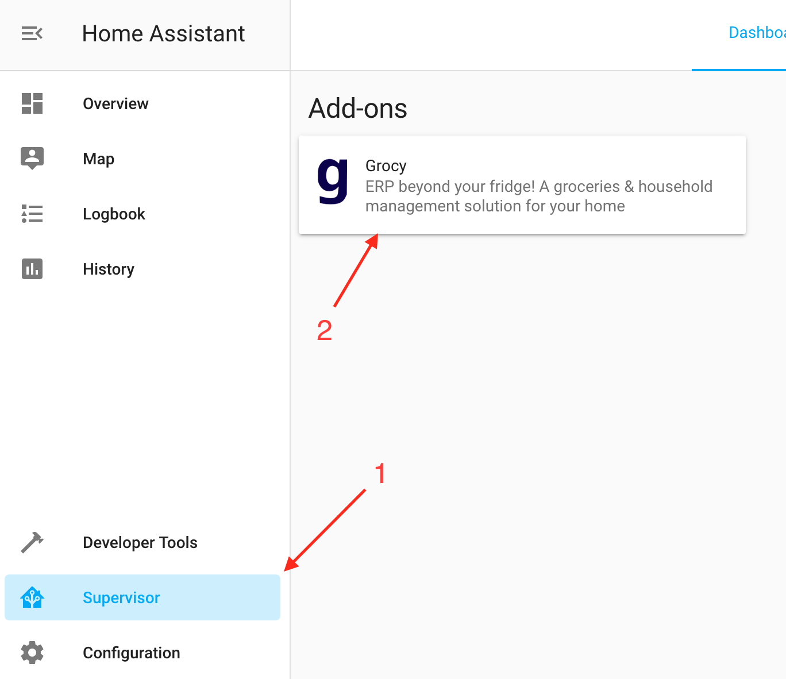
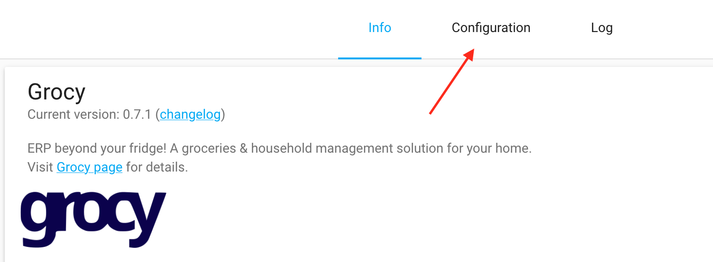
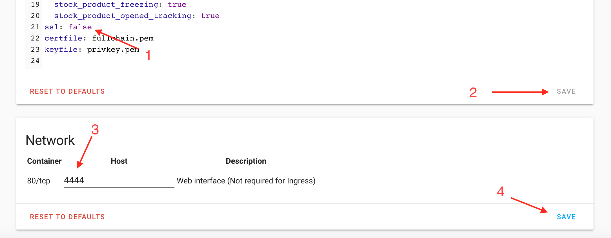

# Configure HomeAssistant

Home Assistant provides an ingress wrapper to Grocy which prevents third part apps
from accesses APIs of addons. The following instructions will make the Grocy app
available outside of the HomeAssistant ingress wrapper.

| Start by clicking the Supervisor link on the sidebar, then select the installed Grocy addon. |   |
| Then enter the configuration page. |   |
| First disable ssl by changing the configuration to `ssl: false` (1).  Correct configuration SSL for Grocy through HA is beyond the scope of these instructions.  Next save the configuration (2).   Below the configuration box select a host port for the web interface (3). Pick a high number but a number below 65000.  Then save the network configuration (4) |   |
{: .constrain-images-in-table }

Following the steps above should automatically restart your Grocy installation.
After Grocy reboots it will be available on the same host/IP but on the new port you
specified.

If you normally access HomeAssistant from http://home-assistant:8123 and you
selected port 2345 in step 3 above, you should now be able to access the Grocy
Web UI at http://home-assistant:2345. You should then use http://home-assistant:2345/api
for the Grocy configuration of PantryParty.
