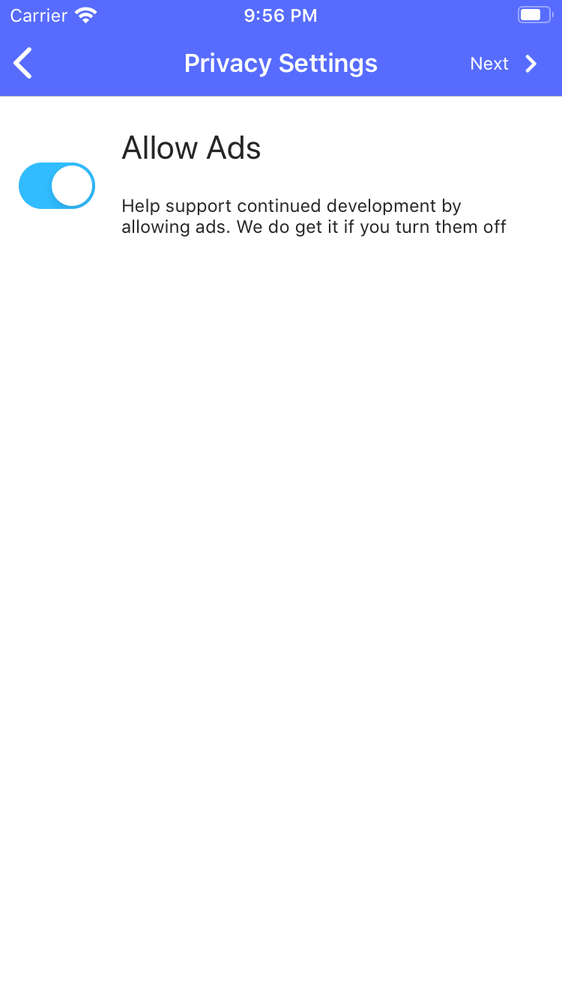

{: .image-frame.clearfix }

# Privacy Settings

I do my best to respect your privacy, and understand that not everyone is willing to allow advertisements, even in a free app.

On this page you have the option of opting out of advertising. If you disabled advertising it may require restarting the app for them to be fully removed (or re-added) to the application.

# Done!
Pantry Party is now fully configured and you are ready to start scanning. Head over to [Basic Usage](../basic-usage) to get started.
