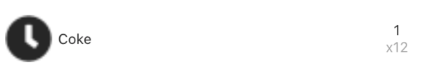

# Release Notes
## Unreleased
* [Awesome new consume page with filters & actions](./docs/basic_usage/current-stock)
* Fix for opening a product actually consuming it
* [Fixes product creation](https://github.com/PantryParty/pantry_party/issues/41) - total rewrite of form builder
* Displays purchase factor to more clearly indicate changes

## 1.0.10
* Fix best before date for adding items to a freezer & opening
* Fix for ads overlapping barcode toolbar

## 1.0.9
* Bugfix for products that do not expire actually being set to expire yesterday. They now expire in 100 years

## 1.0.8
* Added warning about HASS.io setup when the characteristic error shows up.
* Fixed error when the user uses the back button from the settings page
